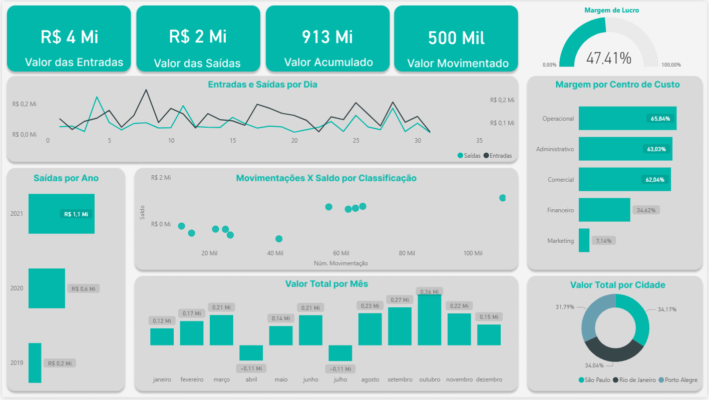

# 💰 Painel de Fluxo de Caixa - Power BI

## 📌 Sobre o Projeto
Este projeto consiste na construção de um painel de **Fluxo de Caixa** desenvolvido no **Power BI**, com o objetivo de fornecer uma visão clara e estratégica das entradas e saídas financeiras.

O dashboard permite acompanhar indicadores essenciais para a gestão financeira, auxiliando na tomada de decisão baseada em dados.

---

## 🎯 Objetivos
- Monitorar entradas e saídas de caixa
- Analisar saldo ao longo do tempo
- Apoiar decisões financeiras estratégicas

---

## 📊 Indicadores Principais
- Receita Total
- Entrada Total
- Saídas Total
- Fluxo de Caixa por Período
- Margem de Lucro

---

## 🛠️ Tecnologias Utilizadas
- Power BI  
- Excel / CSV  
- DAX  

---
## 📸 Preview do Dashboard

---

## 🚀 Como Utilizar
1. Faça o download do arquivo `.pbix`  
2. Abra no Power BI Desktop  
3. Atualize as conexões de dados (se necessário)  
4. Explore os dashboards  

## 📬 Contato
- [LinkedIn](https://www.linkedin.com/in/helena-lima-9269971b4/)

---

## 📝 Licença
Este projeto está sob a licença MIT.
